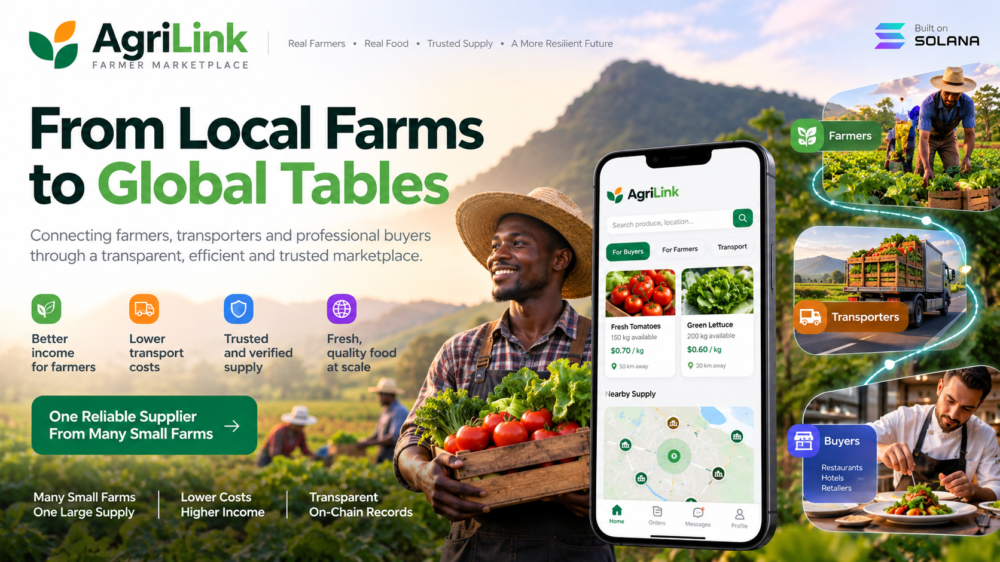

<p align="center"></p>

# AgriLink — Farmer Marketplace

Many small farms, one reliable supplier. AgriLink connects farmers, transporters and professional buyers (restaurants, hotels, retailers) in one marketplace, and records every delivery step so each order can be trusted.

## What it does

- **Farmers** list produce and fulfil orders from a single queue.
- **Buyers** post a request; the app finds nearby farms and splits the order across them, ranked by distance, price and reliability.
- **Transporters** pool compatible deliveries into one truck, cutting transport cost per order (a pool is kept only if it saves at least 10%).
- **Everyone** gets a verifiable trail: each step (ready, pickup, delivery, completion) is hashed and can be anchored on Solana. Disputes and reputation are built on that trail.

## Try it

```bash
docker compose up -d database
python -m venv .venv && .venv/bin/pip install -r api/requirements.txt
.venv/bin/alembic upgrade head
.venv/bin/uvicorn app.main:app --app-dir api --reload     # API on :8000 (docs at /docs)
cd apps/web && npm install && npm run dev                  # web app on :3000
```

Open <http://localhost:3000/login> and pick a demo role (buyer, farmer, transporter or admin). Sample data is seeded on first use.

## Built with

| Layer | Tech |
|---|---|
| API | FastAPI, PostgreSQL + PostGIS (geographic matching) |
| Web | Next.js |
| Audit trail | Solana program (Anchor), optional; a mock provider is the default |

## Tests

```bash
.venv/bin/pytest api/tests
```

## More

Architecture notes and the original build spec are in [`docs/`](docs/).
